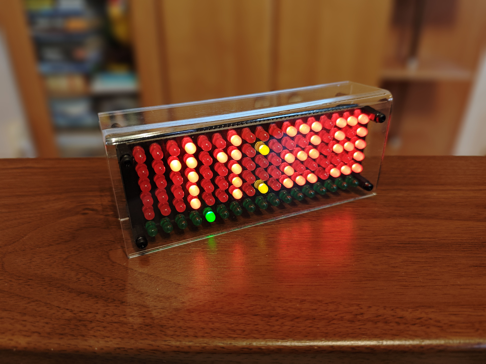
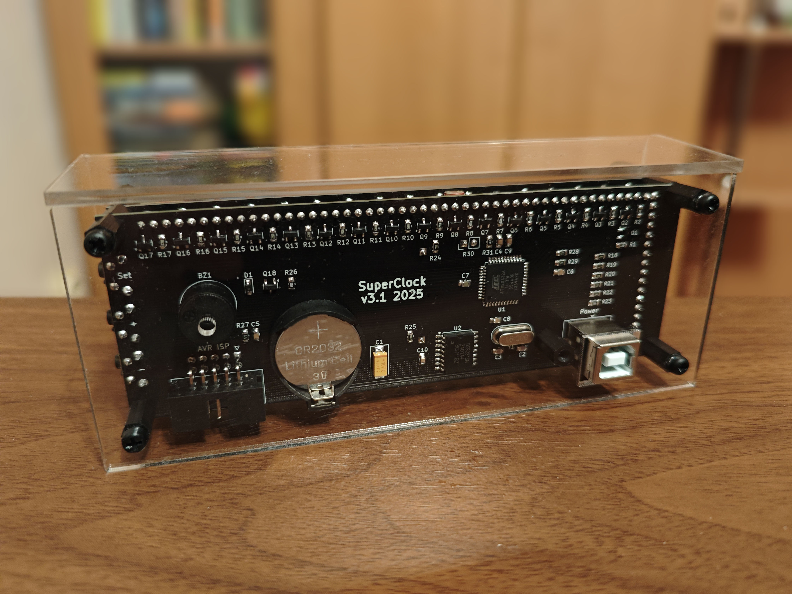

# LED Matrix Super Clock

A DIY desk clock with retro-style dot matrix display

## Features

- A retro-style dot matrix display:
    - 17x6 5mm LED matrix
    - Different LED colors for main area, status bar and number separator
    - No flickering, ghosting or uneven brightness
    - High refresh rate of 460Hz
    - 8-bit global brightness and 3-bit per-pixel brightness
    - Global brightness is automatically (and smoothly) adjusted by ambient conditions, just like on your phone!
- Accurate timekeeping:
    - Temperature-compensated crystal clock (DS3231SN chip)
    - Backup power to keep the clock ticking (CR2032 battery)
    - Displays minute, hour, day, weekday, month, year and even ambient temperature
    - Green status bar tracks seconds (incremented every 4s)
    - Five alarms with melody
- Intuitive (kinda) user interface with three buttons
- Cool acrylic glass frame
- Powered by any USB brick through a Type-B cable
    - Finally, a reason to pick that old printer cable from your drawer!
- Built around ATmega32 microcontroller, with firmware written in C++
    - Uses **every** I/O pin on ATmega32, no wasted potential!
- No AI and no internet connection! (yup, that's a feature nowadays...)
- Totally open-source!

## Documentation

- [Hardware docs](docs/hardware.md)
    - Includes schematics, design files, parts list and even assembly tips
- [Frame docs](docs/frame.md)
    - Describes the acrylic glass frame
- [Software docs](docs/firmware.md)
    - How to flash firmware or set up development tools if you want to modify it
- [LED matrix notes](docs/matrix.md)
    - Notes on how the LED matrix works
- [User manual](docs/manual.md)
    - What do these buttons do?!

## TODO list

- [x] Write this readme
- [x] Make first public release
- [ ] Animated minute/hour transitions
- [ ] Reorganize font system
- [ ] More levels for highest and lowest brightness?
- [ ] Use C++ namespaces?
- [ ] Abstractions for pins and timers?
- [ ] Snake mode? :D
