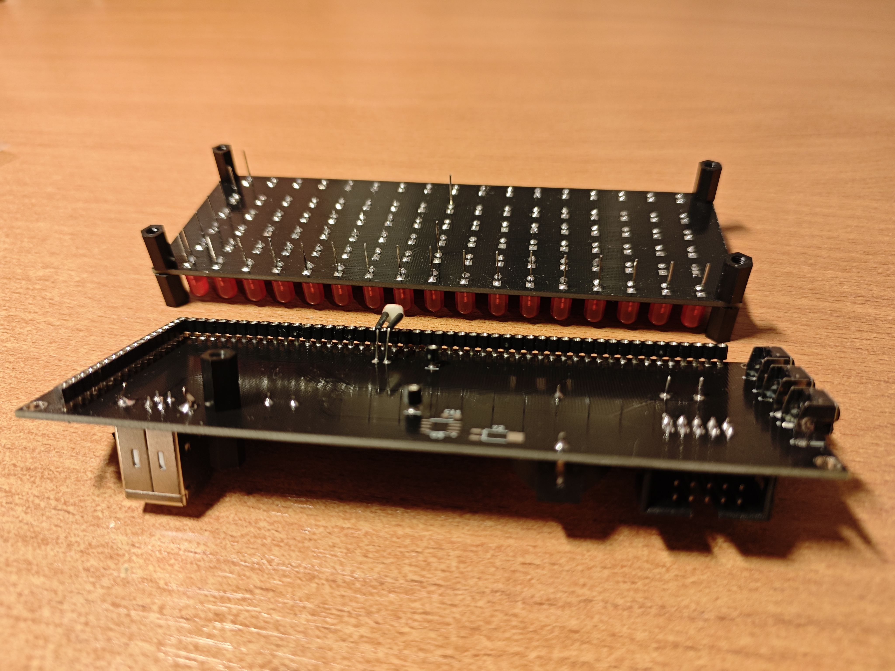

# Hardware notes

## PCBs

The clock is built with two PCBs: the front one that houses LEDs (matrix) and the back one that contains everything else (controller). You can find schematic PDFs, KiCAD design files and Gerber archives here:

- [Matrix board files](../hw/matrix/)
    - [PDF schematic](../hw/matrix/SuperClockMatrix.pdf)
    - [Gerber archive](../hw/matrix/gerber/superclockmatrix.zip)
- [Controller board files](../hw/controller/)
    - [PDF schematic](../hw/controller/SuperClockController.pdf)
    - [Gerber archive](../hw/controller/gerber/superclockcontroller.zip)

The provided Gerber files can be used to order the boards from a multitude of Chinese PCB prototyping factories. I've ordered mine from [Elecrow](https://www.elecrow.com/), but you can also try [JLCPCB](https://jlcpcb.com/) or anything else. Note that these PCBs are wider than the typical 100mm limit, so you are going to pay a little bit more than usual. But it's worth it, I promise!

I recommend ordering the boards with black soldermask and no manufacturer marks (so that the factory won't write anything on the front area). Elecrow makes boards with no markings by default, while JLCPCB offers "Remove Mark" as an option.

## Parts list

### LED matrix

You are going to need a lot of LEDs, so I recommend making a bulk order instead of buying them locally one-by-one. I've bought all the LEDs in 100pcs bags from "[Chanzon Store](https://aliexpress.com/item/32283531722.html)" on AliExpress.

Reference | Quantity | Part name | Notes
--- | --- | --- | ---
\- | 83 | 5mm diffused red LED | You can pick these LEDs anywhere, although I've noticed that no-name red LEDs can be a tad dimmer than the branded ones.
\- | 17 | 5mm diffused green LED | Green LEDs exist in two variants: "green" (515-520nm) and "yellow-green" (570-575nm). You need to get the former ones, as they are **much** brighter. And, of course, if the seller doesn't describe the LED variant, you are going to receive the worst one! But don't worry if you happen to get dim LEDs, all you need is to replace a single resistor.
\- | 2 | 5mm diffused yellow LED | The only LEDs worth buying in retail, as you only need two of them! You can also try the orange ones here.

### Controller board

Reference | Quantity | Part name | Notes
--- | --- | --- | ---
BT1 | 1 | CR2032 generic holder | I don't know the correct part number for this one, but it's widely available on AliExpress, just search for "CR2032 battery holder"
BZ1 | 1 | Generic passive buzzer: 12mm x 8.5mm, 42R (5V) | I don't know the correct part number for this one either, but it's widely available on AliExpress, just search for "passive buzzer 42R"
C1 | 1 | SMD-C 100uF tantalum capacitor | I've used TAJC107K016RNJ, but this can be any matching capacitor
C2-C3 | 2 | SMD 0805 12pF ceramic capacitor | -
C4-C10 | 7 | SMD 0805 0.1uF ceramic capacitor | -
D1 | 1 | 1N5819WS | This diode is used for voltage spike protection in buzzer driving circuit
J1-J4 | 4 | Round-pin single-row machined headers | The controller board requires 1x49, 1x17, 1x1 and 1x1 round-pin machined connectors. Sadly, the first size does not exist in the wild, but you can buy a bunch of 1x40 ones and cut/combine them with ease. You can find the connectors on AliExpress, just search for "round pin female header".
J5 | 1 | USB Type-B 180-degree socket | This is the biggest USB socket, the same kind as in printers or Arduino UNO. The socket must be a vertical one, with pins on the opposite side of the socket. I don't know the correct part number for this, but you can find them on AliExpress, just search for "usb type-b socket 180"
J6 | 1 | 2x5 90-degree IDC socket | The socket for USBasp programmer, used to flash ATmega32. Part numbers vary: it can be IDC-10MR, BH-10R, DS1013-10R or something completely else. You can find them on AliExpress by searching "idc connector"
Q1-Q18 | 18 | AO3416A | A SOT-23 N-channel MOSFET. I recommend using either AO3416, AO3416A or 2N7002K here: these come with built-in ESD protection diodes. But you can also use any of the more popular ones instead: AO3400, IRLML2502, 2N7002, etc: just be morally prepared to replace a few busted ones, as they can be killed by ESD discharge while soldering.
R1-R22, R24-R25 | 24 | SMD 0805 220R resistor | The R1-R17 are here to counteract [display ghosting](matrix.md#led-ghosting). The firmware employs a few tricks that remove ghosting for most brightness levels except for the lowest, so you can avoid soldering 17 resistors if you need them for another project.
R23 | 1 | SMD 0805 3.3K resistor | -
R26, R31 | 2 | SMD 0805 10K resistor | -
R27-R29 | 3 | SMD 0805 4.7K resistor | -
R30 | 1 | GL5516 photo-resistor | -
SW1-SW3 | 3 | 90-degree tactile switch | I don't know the correct part number for this one, but it's widely available on AliExpress, just search for "angle tactile switch"
U1 | 1 | ATmega32A-AU | Should work with any ATmega32 in TQFP-44 package
U2 | 1 | DS3231SN | There also exists a less-accurate part called DS3231M. Both of them work, but you want to get the best one!
Y1 | 1 | HC49S 16MHz Crystal | External crystal for ATmega32
~~U3~~ | ~~1~~ (do not place) | ~~DS1307ZN~~ | I've added this one just in case DS3231 chips become unavailable, but luckily that didn't happen! Don't solder DS3231 and DS1307 together, as they use the same I2C address.
~~Y2~~ | ~~1~~ (do not place) | ~~32.768kHz clock crystal~~ | External crystal for DS1307
~~C11~~ | ~~1~~ (do not place) | ~~SMD 0805 0.1uF ceramic capacitor~~ | Bypass capacitor for DS1307

### Miscellaneous

Reference | Quantity | Part name | Notes
--- | --- | --- | ---
\- | 9 | M3 10mm male-female nylon standoffs | Used to connect the boards together. You can buy a whole kit of standoffs on AliExpress: search for "m3 nylon standoff kit", they come in nice 10-cell boxes.
\- | 5 | M3 10mm female-female nylon standoffs | Used to connect the boards together.
\- | 8 | M3 nylon screws | Used to attach the acrylic frame

## Assembly notes

Assembling the boards should be fairly straightforward, but here are a few hints:

- Square pads on matrix board are LED cathodes, and round pads are LED anodes. All the LEDs are soldered in the same direction.
- LED legs from the matrix board act as connector pins for the controller board. This means that, looking at matrix board from behind, you **must not** cut the LED cathode pins on the top, LED anode pins on the right, and number separator LED anode pins at the center. Instead, carefully trim them to something about 9mm (that's for 10mm standoffs, adjust accordingly if your PCB spacers are different length).
- Mating the boards for the first time might be tricky: the round-pin machined connectors don't like misaligned stuff. To resolve this, carefully align LED legs with tweezers until they all go into the corresponding holes. Once the pins are properly aligned, further board separation/mating cycles should be much easier.
- The hole near USB socket is to provide some additional strength when the cable in inserted: you can put standoffs here to protect the controller PCB and acrylic frame from being bent too much. But don't worry if you don't have spare standoffs anymore: it seems that there is enough rigidity anyway.
- If you've never soldered SMD parts before: don't be intimidated by them! Working with SMDs is actually way easier than with through-hole ones. All the parts used here are big enough to not be annoying, and the probability of solder bridges becomes very low with a good flux. I recommend buying a hot-air soldering gun if you don't have it already, but you can assemble the controller board easily with soldering iron alone. Remember to solder the SMD parts first, then go for the through-holes.
- Be careful with DS3231SN chip: heating it for too much might affect clock accuracy. I recommend soldering it with a temperature-controlled soldering iron instead of hot air gun or reflow oven.
