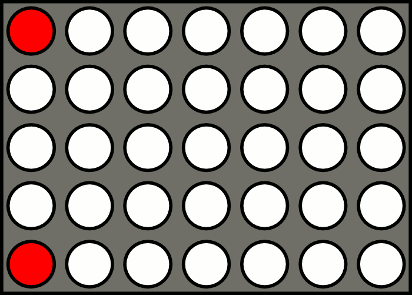

# Notes on the LED matrix

Driving a bunch of LEDs... What could have been easier? Well, turns out the reality is hard!

## Introduction

LED matrix driving relies on phenomenon called "[persistence of vision](https://en.wikipedia.org/wiki/Persistence_of_vision)". There is a really nice [animation](https://en.wikipedia.org/wiki/Persistence_of_vision ) on Wikipedia that I feel obliged to attach:

<p></p>

The LED matrix in this project is driven left to right, just like on the picture! The algorithm is simple: enable rows (LED anodes) and then enable one column (LED cathodes). Once the time comes for another column, switch the old column off, update rows and enable the new column. If you do it fast enough, you'll get an illusion of all columns working simultaneously. But the devil is, of course, in the details!

## Global brightness

Modern LEDs are bright! Good for sunny days, but not-so-good for everything else. The last thing you want is to get blinded by a clock while sneaking to your fridge at night! So, adjustable brightness is essential.

The solution sounds simple: just slap some [pulse-width modulation](https://en.wikipedia.org/wiki/Pulse-width_modulation) (PWM) on! The ATmega32 already comes with several hardware PWM channels. Unfortunately, there are caveats:

- ATmega32 has only four PWM channels, and one is already used to drive the buzzer. No enough for every row!
- Even if there were enough channels (or we applied PWM to LED power source), combining them with matrix-driving is tricky: the PWM and column switch frequencies might alias in a bad way, producing nasty flickering. I've learned that the hard way!

Another option is to combine matrix driving and brightness control in a single algorithm. Use one timer interrupt to enable next column, and another to shut it down. You can use the overflow interrupt for the former and compare interrupt for the latter (or vice versa, it doesn't really matter). Timer compare value can be adjusted, so we can get our adjustable brightness!

```
switch to new column here (overflow interrupt)
|
|      disable the column here (compare interrupt)
|      |
v      v
+------+--------------------------+
0      X <-- configurable        255
\_____/\__________________________/
   |                  |
 LEDs on          LEDs off
```

This idea is much better, but has a few caveats as well. Fortunately, they are manageable:

- You need to run your timer very fast to avoid flickering, and the MCU needs to have enough speed to process both interrupts. This is, essentially, PWM implemented in software. Fortunately, ATmega32 is fast enough to run an 8-bit timer at `F_CPU/8` and handle both interrupts. With `F_CPU` set to 16 MHz the speed is enough to have no perceivable flicker.
- If the timer compare value becomes too close to overflow value, interrupt calls will start overlapping, and you won't see any change in brightness. So, you lose some of the lowest and the highest brightness levels. Fortunately, there is a workaround: combine "LEDs on" and "LEDs off" phases in a single interrupt with a software delay (or without delay at all). This workaround must be enabled only when the delay value is low enough, otherwise you'll waste a lot of CPU time waiting.

## Per-pixel brightness

Per-pixel brightness is useful for smooth animation, but not as important as global brightness. I've implemented it on level above matrix driving and global brightness: 

- Each full display refresh (that's when every column gets scanned and we return to the first one) is a assigned an incrementing number with an overflow value.
- If pixel brightness value is higher than this number, the pixel is lit, otherwise it's dark.
- You can only have a few brightness levels before egregious flickering becomes apparent: that's because refresh cycle frequency gets reduced for dimmed pixels. I've settled on 8 levels (3-bit): that's enough for simple effects.

## Gamma correction

If you ever tried to regulate LED brightness, you've probably seen this phenomenon: for the first few levels brightness change is very fast, but for the last few levels, brightness change is very slow and barely noticeable.

This happens because our eyes do not perceive brightness linearly, but rather do it logarithmically. So, to provide evenly spaced brightness levels, you need to apply the procedure of [gamma correction](https://en.wikipedia.org/wiki/Gamma_correction). For LEDs this usually involves something like fitting your original brightness to `[0.0, 1.0]` range, raising it to a power of three (`gamma=3.0`), and then resizing it back to match your PWM peripheral scale.

The biggest annoyance here is that a lot of PWM levels are going to be unused, so with 8-bit PWM you'll have way less than 255 distinguishable brightness levels. And for 3-bit PWM there is simply not enough resolution for any meaningful gamma correction.

Fortunately, this LED display adjusts global brightness from ambient conditions! Gamma-correction is not needed here, as we aren't accepting user input: we simply match an existing real-world brightness reading that came from a photo-resistor.

As for the per-pixel brightness: it's not very important, and animation frames can be adjusted to account for uneven brightness levels.

## Automatic brightness flicker

Automatic brightness can be very janky. You've probably seen this on older smartphones: for some ambient brightness conditions, display brightness will annoyingly toggle back and forth between two levels.

There are a few solutions to this:

- Implement something close to a [Schmitt trigger](https://en.wikipedia.org/wiki/Schmitt_trigger) in software. This is especially useful when there are few brightness levels that are spaced far apart.
- Apply some filtering to your sensor data to avoid janky readings.

This LED matrix currently employs the second trick: all photo-resistor readings are passed through a first order IIR filter. This is the digital analog of an [RC circuit](https://en.wikipedia.org/wiki/RC_circuit), and is also known as [exponential smoothing](https://en.wikipedia.org/wiki/Exponential_smoothing). Seems good enough!

## Uneven column brightness

If column brightness depends on the amount of lit pixels in it, then your column drivers are not powerful enough. This is very common for displays that use MCU or 74HC595 pins to drive LEDs. The ATMega32 I/Os are only rated up to 40mA, and 74HC595 outputs are only rated up to 35mA. But a single 5mm LED can be safely driven up to 20mA (or more in short bursts): there is just not enough power to drive a bunch of them!

The solution is to use high-current driver ICs, or add transistor switches. This display uses the latter: all the columns are driven through MOSFETS, so column brightness is always consistent.

## LED ghosting

A very common issue for DIY LED matrix displays is ghosting. The most common cause for it are software defects: it can happen when LED rows are reconfigured without disabling column first. If display is scanned left-to right, you'll see ghosts to the **right side** of lit pixels.

But there can be also another cause for ghosting: **parasitic capacitance**. Turns out, that LEDs are also capacitors and can store a tiny charge. On fast refresh speeds and small brightness levels this can result in ghosting as well! If display is scanned left-to right, you'll see a ghosting trail to the **left side** of lit pixels.

The second issue if way nastier, since it can't be fully defeated in software. It can be somewhat reduced by several workarounds, though:

- If no rows in current column are lit, do not enable this column at all!
- If some rows in current column are lit, keep them enabled even when the column is already disabled. Reconfigure them only right before you are ready to enable the next column.

The definitive fix is, however, the hardware one:

- Use a push-pull driver for LED cathodes: setting it low enables LEDs, and setting it high discharges parasitic capacitors.
    - Unfortunately, high current push-pull drivers are virtually non-existent. The popular 74HC595 is out of spec even for this small display, the I/O pins of ATmega32 are not enough either, and anything more powerful is open-drain only.
- Attach a pull-up resistor to cathodes: it discharges parasitic capacitance when open-drain is not open.
    - This one is easier to achieve, and that's how I've dealt with ghosting for this LED display! Most people recommend resistor values of something like 1K-10K, but I've had to lower it down to 220R to combat ghosting on lowest brightness level.